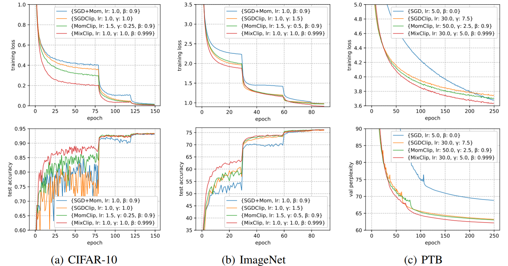

# Training Neural Networks with Clipping Algorithms

A Pytorch(1.4.0) implementation for training neural networks with clipping algorithms on various datasets.  See the paper:  [ Improved Analysis of Clipping Algorithms for Non-convex Optimization ]( https://arxiv.org/abs/2010.02519 ).

The results are shown in the following figure.

- 

## Dependencies

- Pytorch 1.4.0

## CIFAR-10 Training

For the baseline algorithm (SGD), simply run

```
python main_mnist_cifar.py --model 'resnet(32,1)' --algo sgd -b 128 --wd 5e-4 --momentum 0.9 --lr 1.0 --epochs 80,120,150 --seed 2020
```

For other algorithms, change `--algo` command. For example, to reproduce the mixed clipping result, simply run

```
python main_mnist_cifar.py --model 'resnet(32,1)' --algo mix_clip -b 128 --wd 5e-4 --momentum 0.999 --lr 1.0 --gamma 1.0 --epochs 80,120,150 --seed 2020
```

## ImageNet Training

The code is based on Pytorch examples:  https://github.com/pytorch/examples/tree/master/imagenet .

For the baseline algorithm (SGD), simply run

```
python main_imagenet.py -a resnet50 --lr 1.0 --momentum 0.9 --algo sgd [imagenet_data_folder]
```

Here the `[imagenet_data_folder]` is the data folder containing training set and validation set.

For other algorithms, change `--algo` command. For example, to reproduce the mixed clipping result, simply run

```
python main_imagenet.py -a resnet50 --lr 1.0 --gamma 1.0 --momentum 0.999 --algo mix_clip [imagenet_data_folder]
```

## PTB Training

The code is based on the Pytorch 1.0 version of AWD-LSTM:  https://github.com/manuvn/lpRNN-awd-lstm-lm .

For the baseline algorithm (averaged SGD with clipping), simply run

```
python main_lstm.py --batch_size 20 --data [data_folder] --dropouti 0.4 --dropouth 0.25 --seed 2020 --lr 30 --gamma 7.5 --momentum 0.0 --algo sgd_clip --epochs 250
```

Here the `[data_folder]` is the data folder containing training set and validation set.

For other algorithms, change `--algo` command. For example, to reproduce the mixed clipping result, simply run

```
python main_lstm.py --batch_size 20 --data [data_folder] --dropouti 0.4 --dropouth 0.25 --seed 2020 --lr 30 --gamma 5.0 --momentum 0.999 --algo mix_clip --epochs 250
```

##  Citation

If you use this code or our results in your research, please cite as appropriate: 

```
@inproceedings{NEURIPS2020_b282d173,
 author = {Zhang, Bohang and Jin, Jikai and Fang, Cong and Wang, Liwei},
 booktitle = {Advances in Neural Information Processing Systems},
 editor = {H. Larochelle and M. Ranzato and R. Hadsell and M. F. Balcan and H. Lin},
 pages = {15511--15521},
 publisher = {Curran Associates, Inc.},
 title = {Improved Analysis of Clipping Algorithms for Non-convex Optimization},
 url = {https://proceedings.neurips.cc/paper/2020/file/b282d1735283e8eea45bce393cefe265-Paper.pdf},
 volume = {33},
 year = {2020}
}
```

